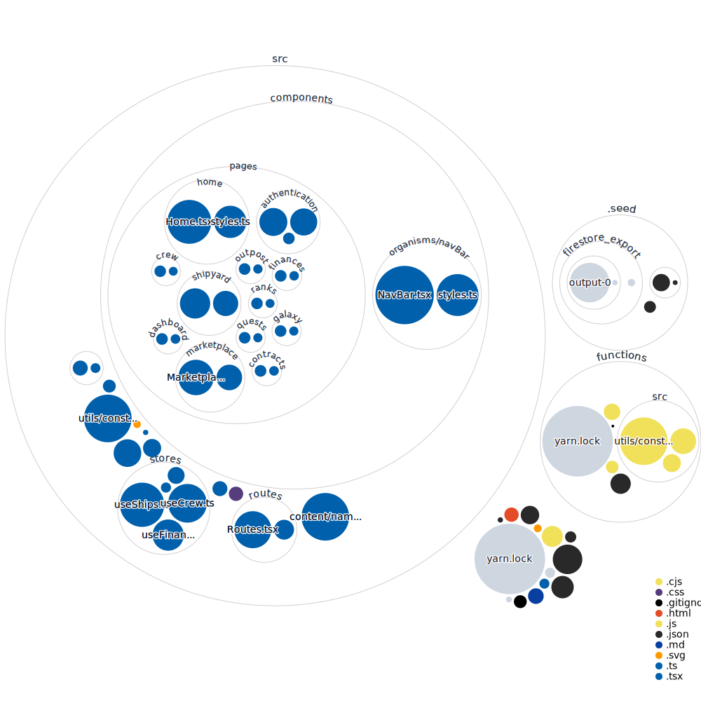
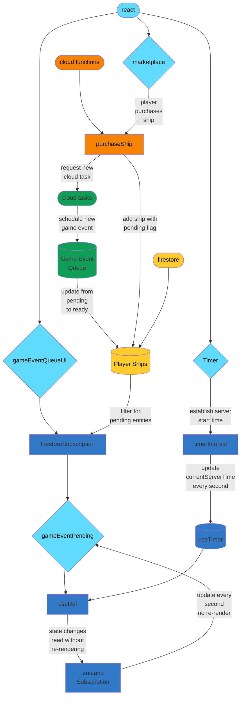

# Outpost Odyssey

Outpost Odyssey: A real-time strategy game where you manage an outpost

Hosted [here](https://outpost-odyssey-web.web.app/) on Firebase

## Repo Structure
### Notable folders:
- `src/` - React web app
- `functions/` - Firebase Cloud Functions (serverless backend)
- `.seed/` - Seed data for the Firebase emulator

## Tips and Tricks

### Getting Started For the First Time
- Install firebase CLI (firebase-tools) globally: `npm install -g firebase-tools`
- Login to the CLI: `firebase login`
- Ensure experimental webframeworks is enabled

### Recommended Workflow
- In one terminal window build ***serverless cloud functions*** (backend) locally in watch mode (see below)
- In a separate terminal window, run the web app and firebase ***emulators*** locally (see below)

To build and watch for changes in ***serverless cloud functions***:
- Navigate to `functions/`
- Run `yarn build:watch`

To simultaneously run the web app and ***emulators*** locally:
- First Time: `yarn serve:reseed` (this will reseed your local emulator with the static seed data)
- After: `yarn serve` (this will run the emulator with your local data)
  - Note: Whenever you shut down the emulator, it will save all data to `.seedLocal/` so that you can persist it locally between emulator runs
- To view the emulator UI, navigate to [http://127.0.0.1:4000/](http://127.0.0.1:4000/)
- To view the web app, navigate to [http://localhost:5173/](http://localhost:5173/)

There is a user already setup for manual testing:
- Username: `emu@test.com`
- Password: `123456`

To update the static seed data checked into the repo:
- BE CAREFUL: This will overwrite the static seed data that everyone uses when you merge to main 
- Ensure the emulator is running with the data you want to export
- In a separate terminal window (at the project root) run `yarn seed:export`

## Notable Architecture Patterns
Note: To view mermaid diagrams in your IDE you can install the mermaid plugin

### Tamper-proof Timestamps:

